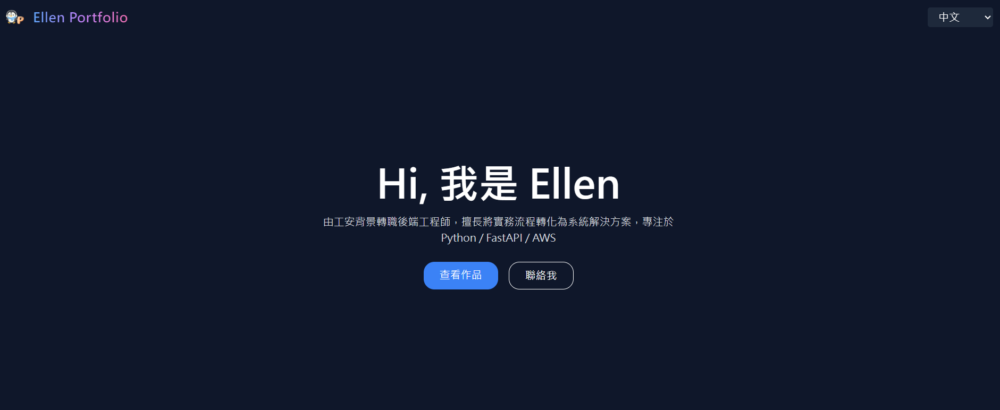
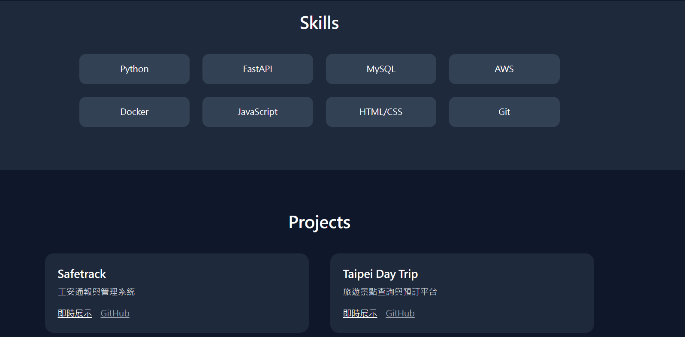
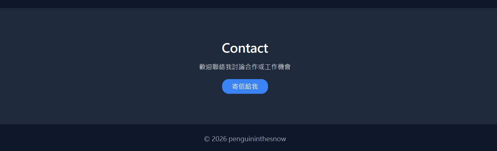

# 🐧 Ellen_portfolio
個人簡歷

由工安背景轉職後端工程師，擅長將實務流程轉化為系統解決方案，專注於 Python / FastAPI / AWS

🌐 **Live Site:** [penguininthesnow.github.io/Ellen_portfolio](https://penguininthesnow.github.io/Ellen_portfolio/)

---

## 👩‍💻 About Me

Hi，我是 Ellen！具備工業安全（工安）實務背景，轉職成為後端工程師後，致力於將真實世界的流程與問題轉化為高效的系統解決方案。專注於後端開發、雲端部署與 API 設計。

---

## 🛠️ Tech Stack

| 類別 | 技術 |
|------|------|
| **後端** | Python、FastAPI |
| **資料庫** | MySQL |
| **雲端 / 部署** | AWS、Docker |
| **前端** | JavaScript、HTML/CSS |
| **版本控制** | Git |

---

## 🚀 Projects

### 🔐 Safetrack — 工安通報與管理系統
工安事件的即時通報、追蹤與管理平台，結合自身工安背景設計而成。

- 🌐 [Live Demo](https://www.penguinthesnow.com/)
- 💻 [GitHub Repo](https://github.com/penguininthesnow/Safetrack)

---

### 🗺️ Taipei Day Trip — 旅遊景點查詢與預訂平台
提供台北景點查詢、導覽介紹與行程預訂功能的旅遊平台。

- 🌐 [Live Demo](http://54.174.188.58)
- 💻 [GitHub Repo](https://github.com/penguininthesnow/Taipei-Day-Trip)

---

## 📬 Contact

歡迎聯絡我討論合作機會或工作邀約！

- 📧 Email: [chouuu0976286138@gmail.com](mailto:chouuu0976286138@gmail.com)
- 🌐 Portfolio: [penguininthesnow.github.io/Ellen_portfolio](https://penguininthesnow.github.io/Ellen_portfolio/)

---

© 2026 penguininthesnow 

